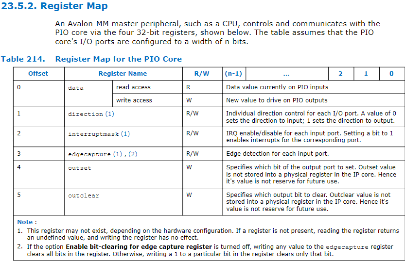
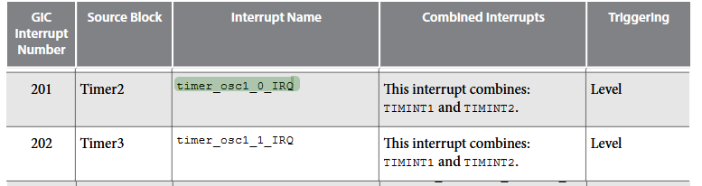
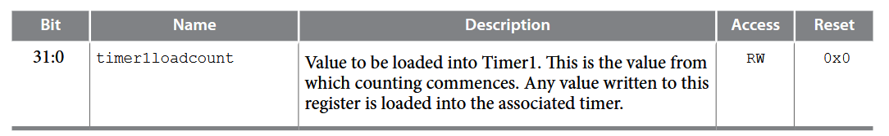
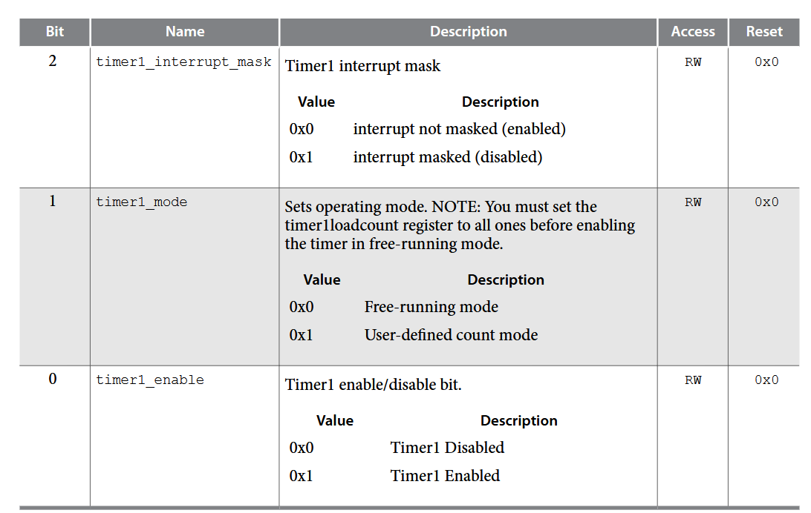
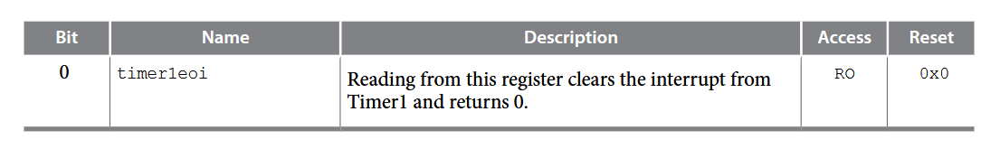
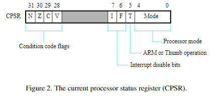
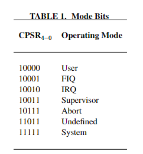

# Laboratoire 04 – Utilisation d’un timer avec les interruptions <!-- omit in toc -->

## Table des matières

- [Code pour lancer le preloader](#code-pour-lancer-le-preloader)
- [Analyse](#analyse)
  - [Plan d'adressage](#plan-dadressage)
  - [Configuration utilisée dans le périphérique PIO 0](#configuration-utilisée-dans-le-périphérique-pio-0)
  - [Configuration utilisée dans le périphérique PIO 1](#configuration-utilisée-dans-le-périphérique-pio-1)
  - [Constante ID 32 bits](#constante-id-32-bits)
  - [Périphérique PIO](#périphérique-pio)
  - [timer module 0](#timer-module-0)
    - [ID d'interruption du timer](#id-dinterruption-du-timer)
    - [Timer loadcount register](#timer-loadcount-register)
    - [Timer Control Register](#timer-control-register)
    - [Timer End of Interrupt Register (EOI)](#timer-end-of-interrupt-register-eoi)
  - [Configuration des interruptions](#configuration-des-interruptions)
    - [ICCPMR](#iccpmr)
    - [ICCICR](#iccicr)
    - [ICDDCR](#icddcr)
    - [ICCIAR](#icciar)
    - [ICCEOIR](#icceoir)
  - [Activation / Désactivation des interruptions](#activation--désactivation-des-interruptions)
- [Programme](#programme)
  - [Démarrage](#démarrage)
  - [Pression sur KEY0](#pression-sur-key0)
  - [Pression sur KEY1](#pression-sur-key1)
  - [Pression sur KEY2](#pression-sur-key2)
  - [Conditions](#conditions)

# Code pour lancer le preloader

```bash

python3 pgm_fpga.py -s=../eda/output_files/DE1_SoC_top.sof
python3 upld_hps.py -a=../../soft/proj/Labo_4/Debug/Labo_4.axf

```

-Wl,--defsym -Wl,arm_program_mem=0x40 -Wl,--defsym -Wl,arm_available_mem_size=0x3fffffb8 -Wl,--defsym -Wl,__cs3_stack=0x3ffffff8 -Wl,--section-start -Wl,.vectors=0x0


# Analyse

## Plan d'adressage

| Adresse               | read                       | write                |
| --------------------- | -------------------------- | -------------------- |
| 0x00_0000 - 0x00_0003 | Design standart ID 32 bits | reserved             |
| 0x00_0004 - 0x00_00FF | reserved                   | reserved             |
| 0x00_0100 - 0x00_0103 | PIO 0 data                 | PIO 0 data           |
| 0x00_0104 - 0x00_0107 | PIO 0 direction            | PIO 0 direction      |
| 0x00_0108 - 0x00_010B | PIO 0 interrupt mask       | PIO 0 interrupt mask |
| 0x00_010C - 0x00_010F | PIO 0 edge capture         | PIO 0 edge capture   |
| 0x00_0110 - 0x00_0113 | reserved                   | PIO 0 outset         |
| 0x00_0114 - 0x00_0117 | reserved                   | PIO 0 outclear       |
| 0x00_0120 - 0x00_0123 | PIO 1 data                 | PIO 1 data           |
| 0x00_0124 - 0x00_0127 | PIO 1 direction            | PIO 1 direction      |
| 0x00_0128 - 0x00_012B | PIO 1 interrupt mask       | PIO 1 interrupt mask |
| 0x00_012C - 0x00_012F | PIO 1 edge capture         | PIO 1 edge capture   |
| 0x00_0130 - 0x00_0133 | reserved                   | PIO 1 outset         |
| 0x00_0134 - 0x00_0137 | reserved                   | PIO 1 outclear       |

## Configuration utilisée dans le périphérique PIO 0

| PIO Bits      | 31-24  | 23-20    | 19-10      | 9-0            |
| ------------- | ------ | -------- | ---------- | -------------- |
| E/S connectés | unused | Key[3:0] | LEDs[9..0] | Switches[9..0] |

## Configuration utilisée dans le périphérique PIO 1

| PIO Bits      | 31-28  | 27-21      | 20-14      | 13-7       | 6-0        |
| ------------- | ------ | ---------- | ---------- | ---------- | ---------- |
| E/S connectés | unused | Hex3[6..0] | Hex2[6..0] | Hex1[6..0] | Hex0[6..0] |

## Constante ID 32 bits 

0xCAFE0004	

## Périphérique PIO



## timer module 0

### ID d'interruption du timer

L'ID du timer qui est connecté à l'oscillateur 1 est 201 et 202, mais on va utiliser le 201.



### Timer loadcount register

Ce registre doit être setter après avoir changer de mode pour être utilisé comme valeur de départ.

La valeur setter est la valeur de cycle de l'oscillateur divisé par la fréquence d'interruption désirée.

Dans notre cas la fréquence d'interruption est de 100ms et la fréquence de l'oscillateur est de 25MHz. Donc la valeur à setter est de 2 500 000.



### Timer Control Register

Ce registre permet de contrôler le timer.

- bit 0 : timer enable
- bit 1 : timer mode
- bit 2 : timer interrupt masked

On va setter au début seulement le bit 1 pour mettre en mode "user-defined count mode".

Pour démarrer le timer, il faudra setter le bit 0 à 1.

Et pour arrêter le timer, il faudra setter le bit 0 à 0.



### Timer End of Interrupt Register (EOI)

Ce registre permet de clear l'interruption. Il faut le lire pour clear l'interruption. La valeur lue est égale à 0.



## Configuration des interruptions

### ICCPMR

The Interrupt Priority Mask Register (ICCPMR) is used to set a threshold for the priority-level of interrupts that will be forwarded by a CPU Interface to an A9 core. Only interrupts that have a priority level greater than the Priority field in ICCPMR will be sent to an A9 processor by its CPU Interface. Lower priority values represent higher priority, meaning that level 0 is the highest priority and level 255 is the lowest. Setting the Priority field in ICCPMR to the value 0 will prevent any interrupts from being generated by the CPU Interface.

> En résumé, si on veut que les interruptions soient traitées, il faut>setter le ICCPMR à 255 pour que toutes les interruptions soient>traitées.

### ICCICR

The CPU Interface Control Register (ICCICR) is used to enable forwarding of interrupts from the CPU Interface to the corresponding A9 core. Setting bit E =1 in this register enables the sending of interrupts to the A9 core, and setting E =0 disables these interrupts.

> En résumé, il faut setter le ICCICR à 1 pour activer les interruptions et à 0 pour les désactiver.

### ICDDCR

API registers in the Distributor are depicted in Figure 6. As described in the previous section, addresses are shown for each register and these addresses correspond to those used in the DE1-SoC Computer. The Distributor Control Register (ICDDCR) is used to enable the Distributor. Setting E =0 in this register disables the Distributor, while setting E =1 enables it.

> En résumé, il faut setter le ICDDCR à 1 pour activer les interruptions et à 0 pour les désactiver.
> S'il est désactivé, les interruptions ne seront pas distribuées.

### ICCIAR

The Interrupt Acknowledge Register (ICCIAR) contains the Interrupt ID of the I/O peripheral that has caused an interrupt. When an A9 processor receives an IRQ signal from the GIC, software code (i.e., the interrupt handler) running on the processor must read the ICCIAR to determine which I/O peripheral has caused the interrupt.

> En résumé, il faut lire le ICCIAR pour savoir quelle interruption a été déclenchée.

### ICCEOIR

After the A9 processor has completed the handling of an IRQ interrupt generated by the GIC, the processor must then clear this interrupt from the CPU Interface. This action is accomplished by writing the appropriate Interrupt ID into the Interrupt ID field in the End of Interrupt Register (ICCEOIR), depicted in Figure 5. After writing into the ICCEOIR, the interrupt handler software can then return control to the previously-interrupted main program.

> En résumé, il faut écrire la valeur lue dans le ICCIAR dans le ICCEOIR pour clear l'interruption.

## Activation / Désactivation des interruptions

Pour activer ou désactiver les interruptions, il est nécessaire de modifier le registre **CPSR**. Cette opération doit être effectuée en mode **privilégié**, accessible après le démarrage du CPU.



Pour activer les interruptions, il faut mettre le bit 7 à **0**. Inversement, pour les désactiver, ce même bit doit être réglé sur **1**.

Afin d'effectuer cette opération, il est impératif d'être en mode **superviseur**. Ce mode correspond à la valeur binaire suivante :  
> **0b10011** = mode superviseur



Pour configurer correctement le registre, il faut combiner les deux valeurs (mode et état des interruptions) pour obtenir la valeur à définir.

- **Désactiver les interruptions** : `0b11010011`  
- **Activer les interruptions** : `0b01010011`

# Programme

## Démarrage

- [x] Eteindre les 10 LEDs
- [x] Hex0, Hex1, Hex2, Hex3 affiche 0
- [x] Afficher l'ID 32 bits en hexadécimal dans la console
- [x] Minuteur est arrêté

## Pression sur KEY0

- [x] Démarre le minuteur

## Pression sur KEY1

- [x] Arrête le minuteur

## Pression sur KEY2

- [x] Charge la valeur des switches comme valeur de départ
- [x] Affiche la valeur sur les afficheurs hexadécimaux
  - [x] Hex0 affiche le dixième de seconde

## Conditions

- [x] chaque 100ms l'affichage est mis à jour
- [x] L'état de la LED8 montre si le minuteur est actif ou non
- [x] Chaque 100ms, la LED9 est inversée
